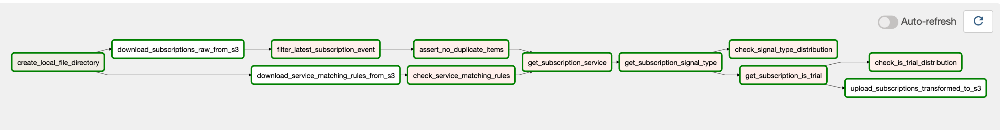

# ANTENNA Data Engineering Case Study

## Purpose

Design and build a python pipeline that identifies key subscription events such as sign-ups and cancellations. 

## Data

"In this project, you are given a small data set that contains anonymised transactions with a number of merchants selling digital products, some of which are SVOD (subscription video on demand) services such as Premium plans on Netflix. We ask you to design and build a python pipeline that identifies key subscription events such as sign-up and cancellation. Such results could then be passed downstream to generate aggregated insights regarding subscriptions to each individual service, for example, how many people signed up for Hulu in September 2020."

 - [Input subscription data](https://antenna-source-a-subscription-us-east-2.s3.us-east-2.amazonaws.com/2021-02-20/ANTENNA_Data_Engineer_Test_Data.csv)
 - [Matching rules](https://antenna-source-a-subscription-us-east-2.s3.us-east-2.amazonaws.com/ANTENNA_Data_Engineer_Matching_Rules.csv)
 - [Output subscription data](https://antenna-source-a-subscription-us-east-2.s3.us-east-2.amazonaws.com/2021-02-20/ANTENNA_Data_Engineer_Test_Data_transformed.csv)

## Pipeline Steps (Directed Acyclic Graph)

1. Extract raw data from S3
2. Transform raw data
    - Get latest subscription row and handle status (New, Update, Delete)
    - Identify Service for subscription (ex. Netflix, Hulu, etc)
    - Identify Signup/Cancellation for subscription
    - Identify Free Trial/Paid for subscription
3. Data Quality Checks
    - (Blocking) Check subscription events have unique item id
    - (Blocking) Check every service matching rule has valid matching command (S, A, R)
    - (Non Blocking) Check distribution of signups/cancellations
    - (Non Blocking) Check distribution of trials/paid 
3. Load transformed data to S3

## Dependencies

This project has the following key dependencies:

| Dependency Name | Documentation                | Description                                                                            |
|-----------------|------------------------------|----------------------------------------------------------------------------------------|
| Docker        | https://www.docker.com/ | We help developers and development teams build and ship apps |
| Airflow        | https://airflow.apache.org/ | A platform created by the community to programmatically author, schedule and monitor workflows |
| AWS S3        | https://aws.amazon.com/s3/ | Object storage built to store and retrieve any amount of data from anywhere |
| Pandas       | https://pandas.pydata.org/ | A fast, powerful, flexible and easy to use open source data analysis and manipulation tool, built on top of the Python programming language.  |

## Repo Structure

- .env: Environment variables used by Docker container
- docker-compose.yml and Dockerfile: Configuration to deploy Airflow in Docker containers
- scripts/entrypoint.sh: Startup bash script to enable Airflow
- dags/: DAG and Task definitions
  - source_a__1__transform_raw_subscriptions.py: Defines the Directed Acyclic Graph to transform raw subscription data (Note: Source A would normally be the actual source for the data)
  - scripts/
    - source_a__1__transform_raw_subscriptions.py: DAG specific python functions that can be called by PythonOperators
    - dag_util.py: Helper python functions for a DAG
    - data_quality.py: Data quality python functions that can be called by PythonOperators
  - config/
     - source_a__1__transform_raw_subscriptions.py: Config variables specific to transform_raw_subscriptions DAG
- files/: Location of local files
- plugins/operators/: Custom Airflow operators 
  - s3_to_local.py: Operator to download files from S3 to local machine, which wraps around the [S3 Hook](https://airflow.apache.org/docs/apache-airflow/1.10.9/_modules/airflow/hooks/S3_hook.html#S3Hook)
  - local_to_s3.py: Operator to upload files from local machine to S3, which wraps around the [S3 Hook](https://airflow.apache.org/docs/apache-airflow/1.10.9/_modules/airflow/hooks/S3_hook.html#S3Hook)

## Deployment

- Download Docker
- Clone the repo locally
- Create .env from sample.env and set variables
- $ docker-compose build
- $ docker-compose up
- Go to http://localhost:8080 once Airflow webserver has started
- Login to local airflow with username and password

